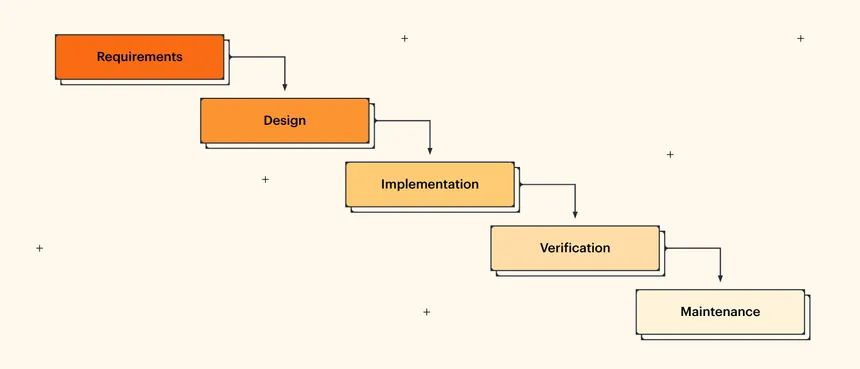

## Modelo escogido 
Modelo cascada con reutilización

Es un modelo sencillo y estaré usando su metodología genérica. Sin embargo, después de la fase de diseño se espera verificación del profesor que no es parte del modelo genérico.
Espero que siguiendo este modelo tenga un producto completado con todos los requisitos esperados a la hora de entrega. 

La fase de mantenimiento no será aplicada en este proyecto.
