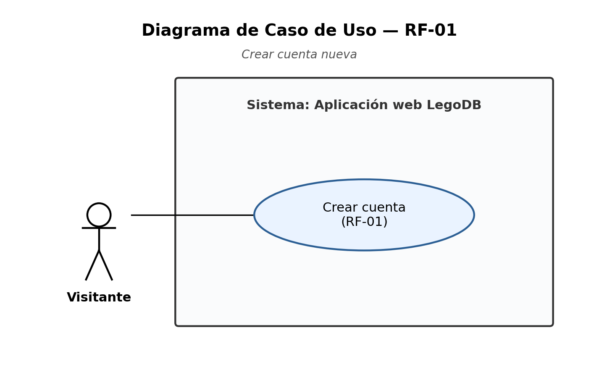
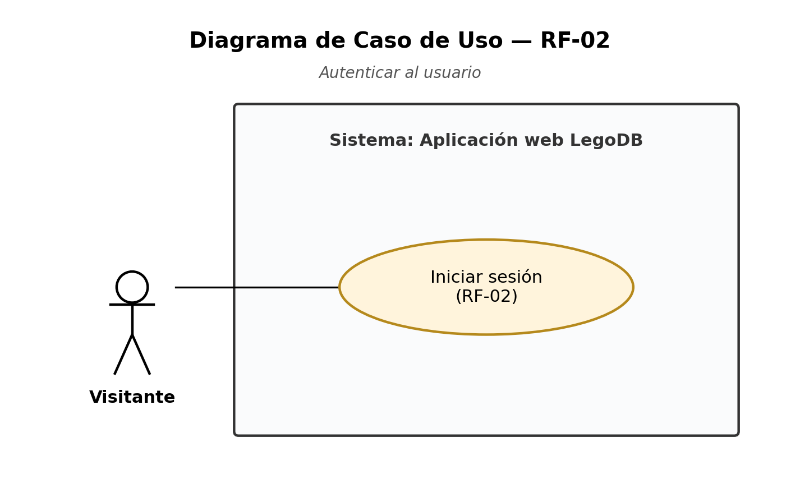
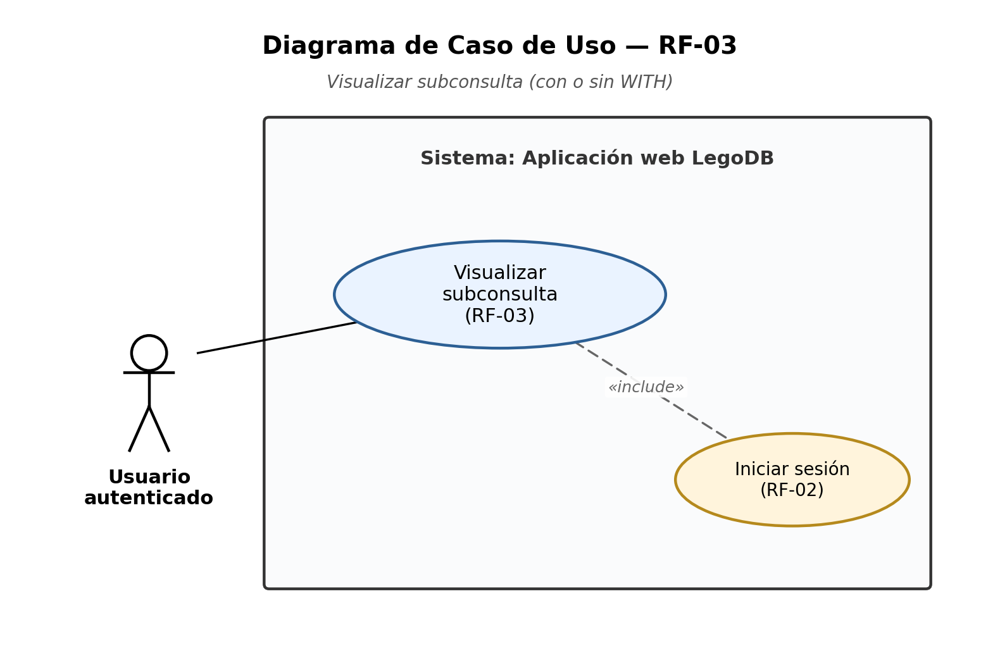
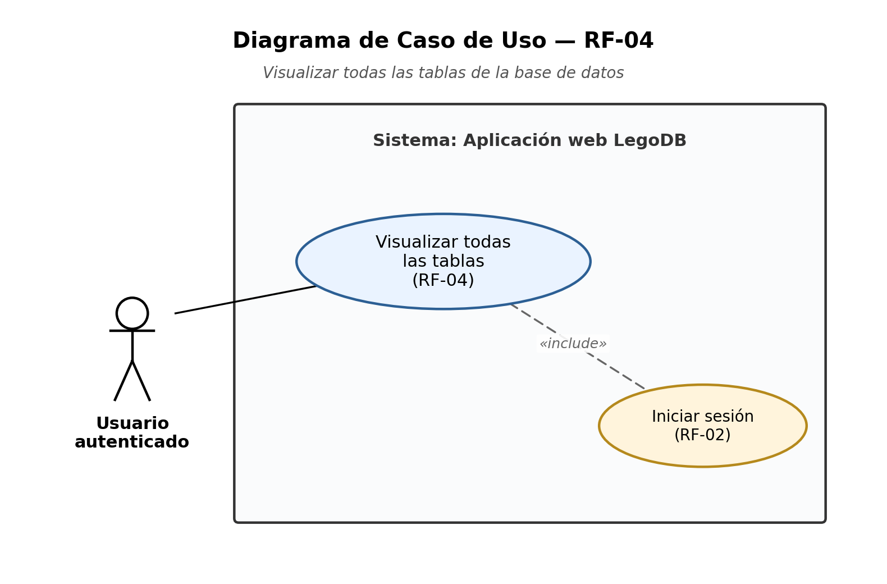
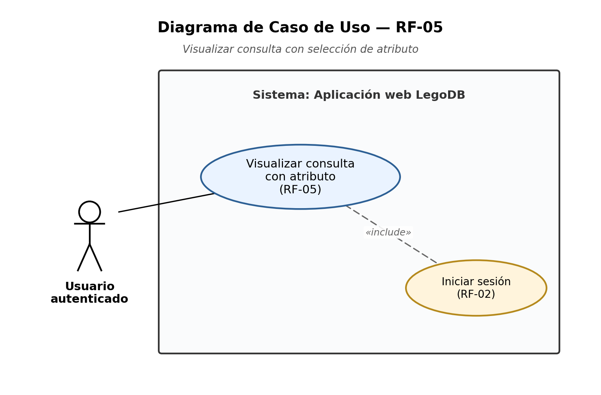
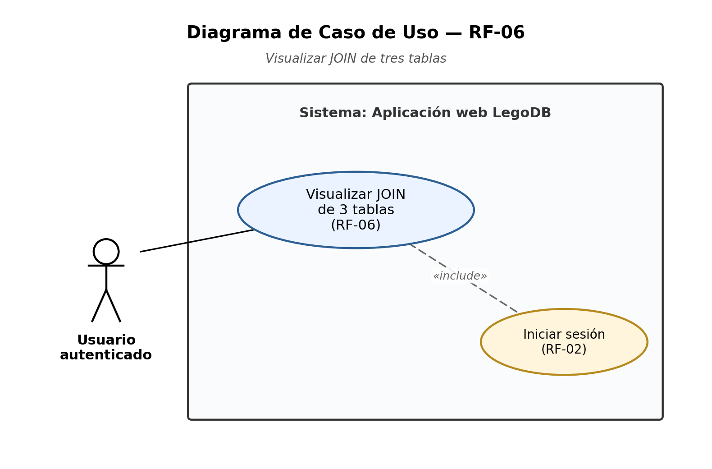
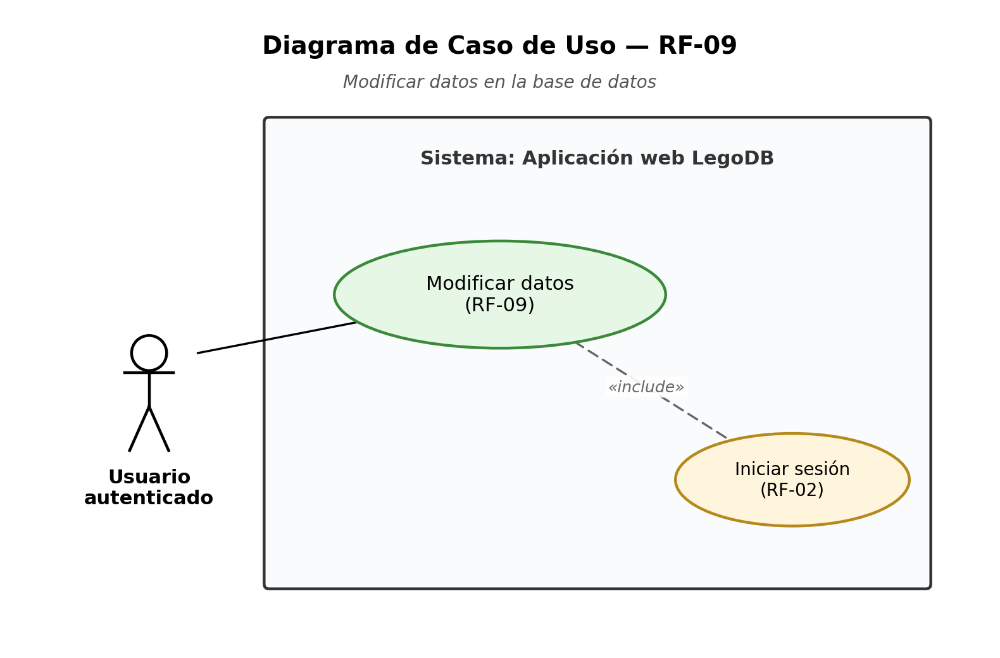

# Especificación de Requisitos Funcionales

Plantillas de especificación detallada para cada requisito funcional definido en el documento de Ingeniería de Requisitos del proyecto **LegoDB** (aplicación web de gestión de conjuntos de LEGO). Cada plantilla sigue el formato adoptado del ejemplo *FocusPoints*.

---

## RF-01: Crear cuenta nueva

| LegoDB                 |                                                                                                                    |
| ---------------------- | ------------------------------------------------------------------------------------------------------------------ |
| Codificación y Función | RF-01: Crear cuenta nueva.                                                                                         |
| Descripción            | Permitir al usuario registrar una cuenta nueva en la aplicación web.                                               |
| Entradas               | Nombre de usuario, contraseña y confirmación de contraseña.                                                        |
| Fuente                 | Usuario visitante no autenticado.                                                                                  |
| Salidas                | Cuenta de usuario creada y mensaje de confirmación.                                                                |
| Destino                | Tabla de usuarios en la base de datos.                                                                             |
| Requerimientos         | El nombre de usuario debe ser único y la contraseña debe cumplir con los criterios mínimos de seguridad.           |
| Precondición           | El usuario no debe tener una cuenta previamente registrada con el mismo nombre de usuario.                         |
| Postcondición          | Se inserta un nuevo registro en la tabla de usuarios y el usuario es redirigido a la pantalla de inicio de sesión. |
| Creador                | Claude Mayo 6, 2026                                                                                                |
| Modificador            | Johnel Cunningham Mayo 7, 2026                                                                                     |

---

## RF-02: Autenticar al usuario

| LegoDB                 |                                                                                             |
| ---------------------- | ------------------------------------------------------------------------------------------- |
| Codificación y Función | RF-02: Autenticar usuario.                                                                  |
| Descripción            | Verificar la identidad del usuario antes de permitirle el acceso a la aplicación web.       |
| Entradas               | Nombre de usuario y contraseña.                                                             |
| Fuente                 | Usuario visitante no autenticado.                                                           |
| Salidas                | Sesión iniciada y acceso autorizado a la página principal.                                  |
| Destino                | Página principal de la aplicación.                                                          |
| Requerimientos         | El usuario debe contar con una cuenta previamente registrada en el sistema.                 |
| Precondición           | Las credenciales ingresadas deben coincidir con un registro válido en la tabla de usuarios. |
| Postcondición          | Se establece una sesión activa para el usuario y se le redirige a la página principal.      |
| Creador                | Claude Mayo 6, 2026                                                                         |
| Modificador            | Johnel Cunningham Mayo 7, 2026                                                              |

---

## RF-03: Visualizar subconsulta (con o sin WITH)

| LegoDB                 |                                                                                                     |
| ---------------------- | --------------------------------------------------------------------------------------------------- |
| Codificación y Función | RF-03: Visualizar subconsulta.                                                                      |
| Descripción            | Mostrar al usuario el resultado de una subconsulta SQL, ya sea anidada o usando la cláusula `WITH`. |
| Entradas               | Solicitud (acción del usuario al seleccionar la opción de visualización de subconsulta).            |
| Fuente                 | Usuario autenticado.                                                                                |
| Salidas                | Tabla con los resultados de la subconsulta ejecutada.                                               |
| Destino                | Página de visualización de consultas.                                                               |
| Requerimientos         | La base de datos debe estar cargada y disponible. El usuario debe haber iniciado sesión.            |
| Precondición           | Existen datos en las tablas necesarias para evaluar la subconsulta.                                 |
| Postcondición          | Se presentan en pantalla los resultados de la subconsulta de manera tabular.                        |
| Creador                | Claude Mayo 6, 2026                                                                                 |
| Modificador            |                                                                                                     |

---

## RF-04: Visualizar consulta de todas las tablas

| LegoDB                 |                                                                                                 |
| ---------------------- | ----------------------------------------------------------------------------------------------- |
| Codificación y Función | RF-04: Visualizar todas las tablas de la base de datos.                                         |
| Descripción            | Mostrar al usuario una consulta que liste todas las tablas existentes en la base de datos.      |
| Entradas               | Solicitud (acción del usuario al seleccionar la opción de listado de tablas).                   |
| Fuente                 | Usuario autenticado.                                                                            |
| Salidas                | Listado con los nombres de todas las tablas presentes en la base de datos.                      |
| Destino                | Página de visualización de consultas.                                                           |
| Requerimientos         | La base de datos debe estar inicializada con sus tablas. El usuario debe haber iniciado sesión. |
| Precondición           | Existen tablas creadas dentro del esquema de la base de datos.                                  |
| Postcondición          | Se presenta en pantalla la lista de las tablas obtenidas.                                       |
| Creador                | Claude Mayo 6, 2026                                                                             |
| Modificador            | Johnel Cunningham Mayo 7, 2026                                                                  |

---

## RF-05: Visualizar consulta con selección de atributo

| LegoDB                 |                                                                                                               |
| ---------------------- | ------------------------------------------------------------------------------------------------------------- |
| Codificación y Función | RF-05: Visualizar consulta con selección de atributo.                                                         |
| Descripción            | Permitir al usuario elegir un atributo de una relación y mostrar el resultado de la consulta correspondiente. |
| Entradas               | Nombre de la relación (tabla) y atributo seleccionado por el usuario.                                         |
| Fuente                 | Usuario autenticado.                                                                                          |
| Salidas                | Columna de valores asociados al atributo elegido dentro de la relación.                                       |
| Destino                | Página de visualización de consultas.                                                                         |
| Requerimientos         | La relación seleccionada debe contener el atributo indicado y poseer datos.                                   |
| Precondición           | El usuario ha seleccionado una relación y un atributo válidos.                                                |
| Postcondición          | Se presentan en pantalla los valores del atributo elegido en formato tabular.                                 |
| Creador                | Claude Mayo 6, 2026                                                                                           |
| Modificador            | Johnel Cunningham Mayo 7, 2026                                                                                |

---

## RF-06: Visualizar JOIN de 3 tablas

| LegoDB                 |                                                                                                      |
| ---------------------- | ---------------------------------------------------------------------------------------------------- |
| Codificación y Función | RF-06: Visualizar JOIN de tres tablas.                                                               |
| Descripción            | Mostrar al usuario el resultado de una consulta SQL que combina al menos tres tablas mediante JOIN.  |
| Entradas               | Solicitud (acción del usuario al seleccionar la opción de visualización de JOIN).                    |
| Fuente                 | Usuario autenticado.                                                                                 |
| Salidas                | Tabla con los registros resultantes del JOIN entre las tres tablas relacionadas.                     |
| Destino                | Página de visualización de consultas.                                                                |
| Requerimientos         | Las tres tablas involucradas deben tener datos y poseer las claves foráneas necesarias para el JOIN. |
| Precondición           | Existen registros relacionados en las tres tablas que permitan obtener resultados no vacíos.         |
| Postcondición          | Se presentan en pantalla los registros combinados resultantes del JOIN.                              |
| Creador                | Claude Mayo 6, 2026                                                                                  |
| Modificador            |                                                                                                      |

---

## RF-07: Visualizar consulta con agregación

| LegoDB                 |                                                                                                                  |
| ---------------------- | ---------------------------------------------------------------------------------------------------------------- |
| Codificación y Función | RF-07: Visualizar consulta con agregación.                                                                       |
| Descripción            | Mostrar al usuario el resultado de una consulta SQL que utiliza funciones de agregación (`GROUP BY` / `HAVING`). |
| Entradas               | Solicitud (acción del usuario al seleccionar la opción de visualización de agregación).                          |
| Fuente                 | Usuario autenticado.                                                                                             |
| Salidas                | Tabla con los datos agrupados y los valores agregados.                                                           |
| Destino                | Página de visualización de consultas.                                                                            |
| Requerimientos         | Las tablas involucradas deben tener datos suficientes que permitan realizar agrupaciones significativas.         |
| Precondición           | Existen registros en las tablas que permiten ejecutar la operación de agregación.                                |
| Postcondición          | Se presentan en pantalla los grupos calculados con sus respectivos valores agregados.                            |
| Creador                | Claude Mayo 6, 2026                                                                                              |
| Modificador            | Johnel Cunningham Mayo 7, 2026                                                                                   |

---

## RF-08: Insertar datos

| LegoDB                 |                                                                                                                   |
| ---------------------- | ----------------------------------------------------------------------------------------------------------------- |
| Codificación y Función | RF-08: Insertar datos.                                                                                            |
| Descripción            | Permitir al usuario insertar nuevos registros en una de las tablas de la base de datos.                           |
| Entradas               | Tabla destino y los valores correspondientes a cada uno de los atributos requeridos.                              |
| Fuente                 | Usuario autenticado.                                                                                              |
| Salidas                | Mensaje de confirmación y nuevo registro persistido en la tabla.                                                  |
| Destino                | Tabla seleccionada en la base de datos.                                                                           |
| Requerimientos         | Los datos ingresados deben respetar los tipos de dato, restricciones de integridad y claves foráneas de la tabla. |
| Precondición           | La tabla destino debe existir y el usuario debe contar con permisos de inserción.                                 |
| Postcondición          | Se inserta un nuevo registro en la tabla y el usuario recibe confirmación visual.                                 |
| Creador                | Claude Mayo 6, 2026                                                                                               |
| Modificador            |                                                                                                                   |

---

## RF-09: Modificar datos

| LegoDB                 |                                                                                                                       |
| ---------------------- | --------------------------------------------------------------------------------------------------------------------- |
| Codificación y Función | RF-09: Modificar datos.                                                                                               |
| Descripción            | Permitir al usuario modificar registros existentes dentro de una tabla de la base de datos.                           |
| Entradas               | Tabla, identificador del registro y los nuevos valores de los atributos a modificar.                                  |
| Fuente                 | Usuario autenticado.                                                                                                  |
| Salidas                | Mensaje de confirmación y registro actualizado en la base de datos.                                                   |
| Destino                | Tabla seleccionada en la base de datos.                                                                               |
| Requerimientos         | El registro a modificar debe existir previamente y los nuevos valores deben respetar las restricciones de integridad. |
| Precondición           | El usuario ha seleccionado un registro válido y proveyó valores que cumplen las restricciones del esquema.            |
| Postcondición          | El registro queda actualizado en la tabla y el usuario recibe confirmación visual.                                    |
| Creador                | Claude Mayo 6, 2026                                                                                                   |
| Modificador            |                                                                                                                       |

---

## Trazabilidad de requisitos

| RF #  | Resumen                                | Caso de uso asociado                          |
| ----- | -------------------------------------- | --------------------------------------------- |
| RF-01 | Crear cuenta nueva                     | Crear cuenta                                  |
| RF-02 | Autenticar al usuario                  | Iniciar sesión                                |
| RF-03 | Visualizar subconsulta                 | Visualizar subconsulta                        |
| RF-04 | Visualizar todas las tablas            | Visualizar tablas de la base de datos         |
| RF-05 | Visualizar consulta con atributo       | Visualizar consulta con atributo seleccionado |
| RF-06 | Visualizar JOIN de 3 tablas            | Visualizar JOIN de tres tablas                |
| RF-07 | Visualizar consulta con agregación     | Visualizar consulta con agregación            |
| RF-08 | Insertar datos                         | Insertar datos                                |
| RF-09 | Modificar datos                        | Modificar datos                               |
